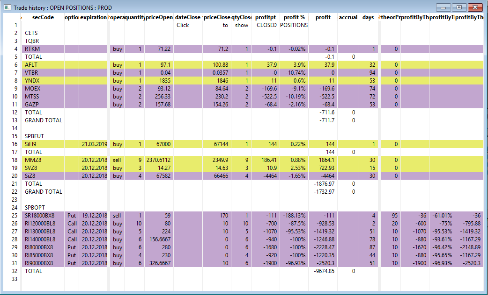
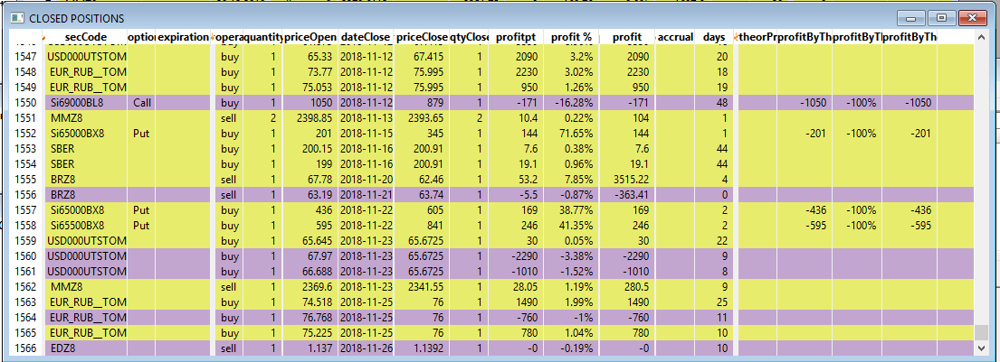
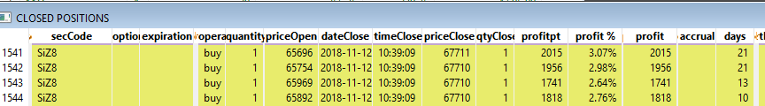
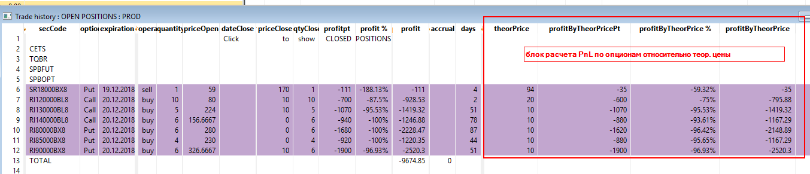

# TradeHistory for QUIK
Скрипт на LUA для расчета PnL по ФИФО, отображения текущих и закрытых позиций.
Предназначен для запуска в торговом терминале QUIK производства компании ARQA.

## Что умеет:
  * Фиксирует сделки и сразу рассчитывает финансовый результат по фифо.
  * Отображает открытые позиции.
  * Отображает детализацию открытых позиций по партиям - при даблклике на строку с позицией.
  * Позиции можно скрывать/разворачивать по классам - щелчок на имени класса.
  * Отображает закрытые позиции и финансовый результат по ним.

## Установка и запуск

  * Скачайте проект "как есть" в любую папку на вашем компьютере (зеленая кнопка Clone or download).  
  * Запустите скрипт TradeHistory.lua в терминале QUIK через меню Сервисы-LUA скрипты.  
  Откроется главное окно скрипта с таблицей, в которой будут отображены основные классы инструментов на Московской бирже.  
  * Совершайте сделки, скрипт будет регистрировать их в своей базе и выводить в таблицу открытых позиций.  
  * Оценивайте финансовый результат по закрытым сделкам - для этого откройте окно "Closed positions" двойным щелчком на строке "Click to show CLOSED POSITIONS".  

## Настройки

  Настройки хранятся в файле TradeHistory_settings.lua  

  * self.groupByClass = true/false - включает группировку инструментов по классам  
  * self.filter_by_class = {}  
	self.filter_by_class['SPBFUT']=true - разворачивает содержимое класса при запуске скрипта (если есть позиции по бумагам этого класса).  
  * self.db_path = getScriptPath() .. "\\positions2.db" - путь к базе данных.  
  * self.dark_theme = true/false - переключает темы оформления (светлая/темная).  
  * self.show_total_collateral_on_forts = true/false - показывать общую сумму ГО на ФОРТС.  
  * self.show_totals = true/false - показывать итоги для каждого класса (если есть группировка по классам).  
  * self.columns_visibility = {}  
    self.columns_visibility["account"]=true/false - выбор колонок для отображения. Если сделать колонку невидимой, то она все равно будет отображаться в таблице, но с нулевой шириной (можно раздвинуть мышкой).  
	
## Основные принципы

  * Регистрация сделок в базу данных происходит в событии OnTrade(). После записи сделки запускается обновление позиции в главном окне.  
  * Расчет финансового результата осуществляется по ФИФО, таким же образом считает и брокер.  
  * Открытые позиции показывают прибыль/убыток в реальном времени при каждом изменении цены последней сделки конкретного инструмента.  
  * Финансовый результат по открытым позиция показывается "виртуальный", рассчитан по лучшей цене bid для длинной позиции и ask для короткой.  
  * Для производных инструментов, котируемых в пунктах, например, фьючерс на индекс RTS, также рассчитывается рублевый финансовый результат на основании шага цены и стоимости этого шага, транслируемого брокером в терминал.  
  * Вариационная маржа за каждую торговую сессию по деривативам не определяется и на первоначальную стоимость позиции не влияет. Это позволяет видеть реальный финансовый результат на всю позицию с момента ее открытия.  
  
  * На текущий момент скрипт рассчитывает финансовый результат по всей истории сделок. При большом их количестве возможны задержки при обработке события OnTrade(), т.к. в этот момент пересчитывается вся история сделок по инструменту, вызвавшему событие.  
  
  * Открытые позиции
  
  Открытые позиции отображаются в главном окне (см. первый скриншот).  
  
  * Закрытые позиции
  
  Закрытые позиции можно посмотреть в отдельном окне, которое открывается по двойному щелчку на строке "Click to show CLOSED POSITIONS".  
  Данное окно выглядит идентично главному, но в нем заполнена дата закрытия позиции.  
  Итоговый фин. результат показан в колонках 'profitpt', 'profit %', 'profit' (рублевый).  На фин. рез. -100% по теор. цене для опционов обращать внимание не следует - это особенность скрипта. Данные колонки в закрытых позициях переоцениваются общей функцией, а цена по таким опционам равно нулю, т.к. они давно экспирировались.  
  
  
  
  Закрытие позиции отображается в разрезе партий.  На изображении ниже видно, что длинная позиция, набранная четырьмя сделками в разное время, закрылась одной продажей.  
  На текущий момент общий фин. рез. по этой позиции можно посчитать, только сложив результаты по каждой партии.  
  
  

  * Опционы.
  
  По опционам реализовано отображение дополнительной информации:
  - тип опциона - колонка optionType.  
  - PnL относительно теоретической цены - см. блок, выделенный на скриншоте.  
  
  
  

  
## Развитие

  * Оптимизация расчета ФИФО.  
    Реализовать хранение промежуточных итогов, чтобы:  
	  1 при значительных объемах сделок быстрее отображать изменения в открытых позициях.  
	  2 быстрее открывать окно закрытых позиций.  
  * Интерфейс для добавления/удаления сделок из базы
  * Отчеты по финансовому результату (в разрезе торговых счетов, классов, отдельных бумаг)
  * Опционы в закрытых позициях - убрать -100% по теор. цене.
  *
  *
  *
  